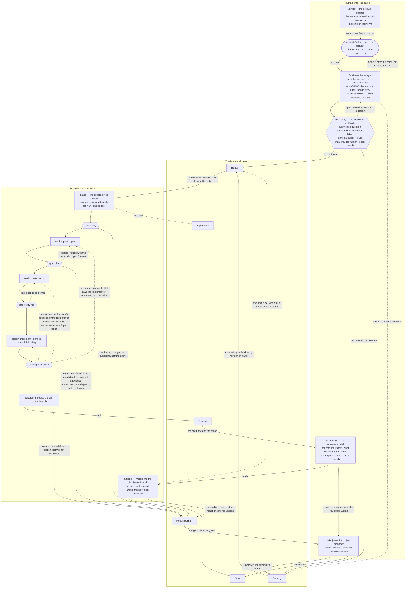

# The cycle, as the code has it

<!-- Generated by scripts/cycle.sh from the set and the CLI. Do not edit by hand:
     `make cycle` regenerates it, and `make check` fails while it is stale. -->

Two halves, one boundary. The human half is a conversation with no gates: it
decides what is worth building and writes it down. The machine half is headless
and never asks: it builds what the ticket says, and a gate judges every station.
They meet only on the board.

## The human half — the roles

Each is a skill under `sets/claude/skills/`, and a slash command of the same
name. `/aif-setup` says which of them can run on this machine.

What passes between the first two is a file, `requests/<slug>.md`, and it carries
its own status: `not cut` when the product partner writes it, `cut in part` with one
line per slice once the analyst has made cards, `cut` when every slice has one.

| skill | role | needs |
|---|---|---|
| /aif-po | The product partner | claude |
| /aif-ba | The analyst | claude board |
| /aif-review | The reviewer's brief | claude board |
| /aif-pjm | The project manager | claude board |
| /aif-setup | Set the foundry up on this machine | claude |

## The board

The columns `lib/board.sh` knows, on a local board or on Trello — and `aif land`
is how a card leaves Review for Done:

`backlog → ready → in progress → review → done`, plus `Needs Human`.

Every transition goes through `aif board`.

## The machine half — stations and gates

The stage order is the list in `lib/run.sh`; each station's own file says
which gate judges it. The `ready` gate runs first, at intake, before the first
token, and it is the same script the analyst ran at the end of the conversation.

| stage | engine | judged by | attempts | requires | leaves behind |
|---|---|---|---|---|---|
| plan | opus (careful) | plan | 3 | ready | plan.md |
| tests | opus (careful) | verify-red | 4 | plan | tests.lock.json, frozen |
| implement | sonnet, or opus when the ticket's risk is high | green, scope | 3 | plan, verify-red | the code, bound to plan.md |

## The caps on one run

From `sets/claude/project.templates/`; a project's own `.aif/project.json`
may set others. The wall clock and the dispatch cap always apply.

| cap | value | setting |
|---|---|---|
| a station rejected in a row | 3 (tests 4) | limits.attempts_max, or max_attempts in the station's aif:meta |
| the same complaint twice in a row | stop | the convergence rule, lib/cmd_work.sh |
| repairs of the oracle, per ticket | 2 | limits.repairs_max |
| replans, per ticket | 1 | limits.replans_max |
| station runs in one ticket's run | 16 | limits.run_dispatches_max |
| wall clock, minutes | 120 | limits.run_max_minutes |
| dollars | off unless a project or the caller sets it | limits.run_budget_usd |
